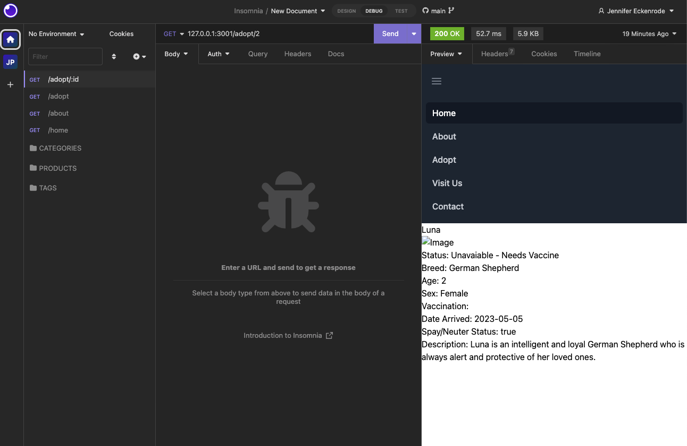

# Full-Stack Application: Clifford's Dog Shelter

## Description

Project Repository:

 https://github.com/princessjenn/Project-2.git

Deployed HEROKU application:

 https://project-2-fullstack.herokuapp.com/

My team has conceived and executed a design that solves a real-world problem. We are required to create our first collaborative full-stack application, while combining a robust back-end with servers, databases, advanced APIs, and user authentication—to an intuitive front end.

My project group used everything have learned over the past fourteen modules of our bootcamp to create a full-stack application that works with real-world data to solve a real-world challenge. In this second project, we demonstrate our problem-solving skills, which employers will want to see when we begin to interview for development roles.

User Story:

AS an employee at a dog shelter,
I WANT a back end and front end application that I can post/create a dog’s information and records
SO THAT potential dog owners can view the shelter website and apply to adopt the dogs that are posted

Acceptance Criteria:

AS an employee at a dog shelter,
WHEN I open the homepage,
THEN I am presented with the Dog Shelter’s main page of the website.
WHEN I click on the ‘Login’ Tab in the navigation bar,
THEN I am led to the Dog Shelter’s employee login form page.
WHEN I enter accurate employee credentials into the login form and click the ‘submit’ button,
THEN the session saves on the server and I am able to view dogs with employee editing privileges.
WHEN I click on the ‘Adopt’ tab in the navigation bar to view all dogs at the shelter as an employee,
THEN I am presented with a “Create New Dog Entry” button.
WHEN I click on the “Create New Dog Entry”
THEN I am presented a form where I can add a new dog’s name, breed, age, sex, vaccination, date arrived, spay/neuter status.
WHEN I fill out the form click “submit”,
THEN the new dog will be posted onto the website.
WHEN I click on the ‘Adopt’ tab in the navigation bar to view all dogs at the shelter as an employee,
THEN I am able to click the ‘edit’ button on a specific dog to update a dog’s vaccination status, the spay/neutered status, or the availability of the dog.
WHEN I search a dog by it’s specific id, 
THEN I am presented with the dog’s information and records status.

## Table of Contents

- [Installation](#installation)
- [Usage](#usage)
- [Contributing](#contributing)
- [Tests](#tests)
- [Questions](#questions)

## Installation

Here are the steps to set up a port to view the server where the application will run!

Firstly, install dependencies (i.e. node.js, express.js, MySQL, Sequelize, nodemon):

`npm install`

Run database inside shell:

`mysql -u root -p`

Then, enter MySQL password.

Next, grab your database from your schema.sql:

`source db/schema.sql`

Exit shell:

`exit`

In terminal, run seeds inside database:

`npm run seed`

Finally, you can invoke the application to start!

`node server.js`

## Usage

## License 

This project is licensed under the terms of the MIT license.

## Contributing

To contribute to the project: 

1. Start by forking the repository and creating a new branch specifically for your new feature or bug fix.
2. It's important to adhere to the project's coding standards and properly format your code.
3. When committing changes, be sure to write clear and concise messages that describe the changes made.
4. If your contribution affects the user interface or experience, include screenshots or animated GIFs in your pull request to help reviewers understand the changes. 
5. Additionally, make sure your code is thoroughly tested and all existing tests pass before submitting the pull request.
6. Finally, provide a detailed description of your changes and explain why they're necessary.

Thanks for contributing! 

## Tests

First thing we needed to test before building the rest of our application was making sure that our Get API fetches were routing properly from our database Models, to the View. To test these endpoints we used help from Insomnia, and here is a screenshot example of a successful 200 response getting ONE dog's info by it's ID, therefore responding correctly through the Handlebars view!

## Questions

Our Personal Github Repositories:

Jennifer:

Jason:

Brian:

